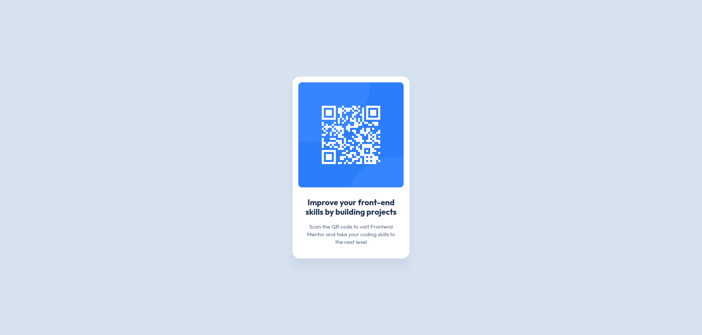

# Frontend Mentor - QR code component solution

This is a solution to the [QR code component challenge on Frontend Mentor](https://www.frontendmentor.io/challenges/qr-code-component-iux_sIO_H).

## Table of contents

- [Overview](#overview)
  - [Screenshot](#screenshot)
  - [Links](#links)
- [My process](#my-process)
  - [Built with](#built-with)
  - [What I learned](#what-i-learned)
  - [Continued development](#continued-development)

## Overview

### Screenshot

### Links

- Solution URL: [Solution URL](https://github.com/shubhamadak535/QR-code-component)
- Live Site URL: [Live site URL](https://shubhamadak535.github.io/QR-code-component/)

## My process

### Built with

- Semantic HTML5 markup
- CSS properties
- Flexbox

### What I learned

- CSS Box model: how HTML elements are represented on the webpage.
- Semantic HTML: HTML tags that represent the type of content they enclose.
- Importing fonts from Google fonts.
- Centering using flexbox.
- Reading element dimensions, font properties, and colors from a figma file.

### Continued development

- Better understand semantic HTML.
- Get to know more CSS relative sizing properties.

